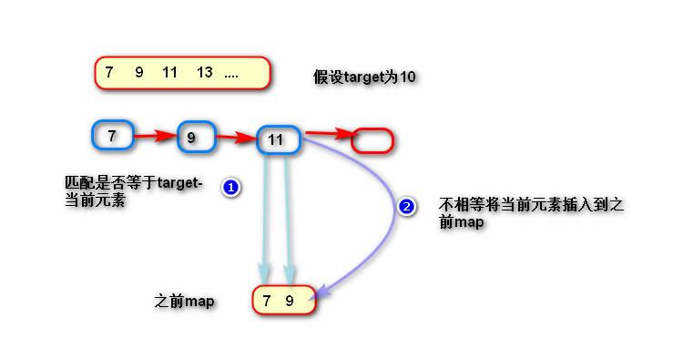

# 目录

* 两数之和 

***


###  两数之和

*题目描述：*

  给定一个数组nums 和一个目标值target，请你在数组中找出和为该目标值的那两个整数，并返回数组下标，你可以假设每种输入只有一个答案，但你不能重复利用数组中同样的元素

示例：nums = [2,7,11,15] ,target = 9 返回 [0,1]

***

*分析：*

* 方式一：暴力比对，用两个循环，内循环比外循环靠后一个值，比对相加是否等于9，匹配返回。时间复杂度O(n²)；

* 方式二：循环，将数组循环整体赋值给map，在循环数组比对map中是否含有(9-当前元素)，时间复杂度O(2*n)；

* 方式三：循环，循环的过程，把循环过的元素存在map中，我们这里叫**之前map**，循环时先判断（9-当前值）是 否存在于 **之前map**，存在，支姐返回下标，不存在，继续把当前值存在 **之前map** ；*注意*：map中key值为数组元素值，value值为下标 {值，下标}    使用到方法 containsKe有，时间复杂度O(n)    最 优

​    图解：

   

​		

  ```java
public int[] twoSum(int[] nums,int target){
        fMap<Integer,Integer> beforeMap = new HashMap<Integer,Integer>();
        int findVal;
        for(int i = 0; i < nums.length; i++){
            findVal = target - nums[i];
            if(beforeMap.containsKey(findVal)){
                return new int[]{beoreMap.get(findVal),i};
            }
            beforeMap.put(nums[i],i);
        }
        return null;
    }
  ```


